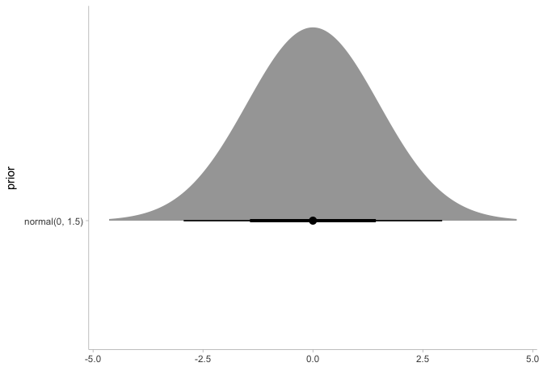
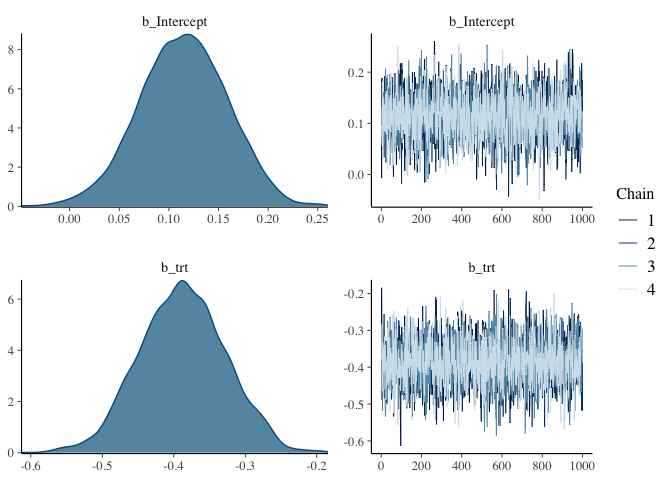
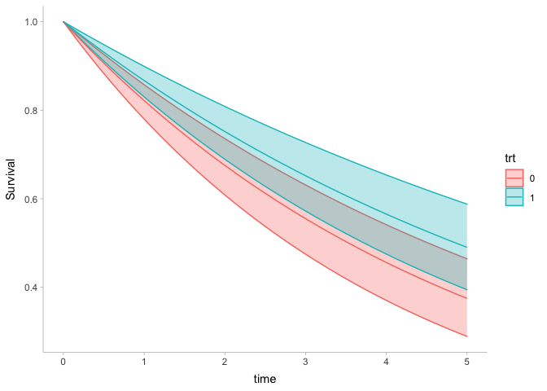

Bayesian survival analysis
================
Lars Mølgaard Saxhaug

``` r
knitr::opts_chunk$set(echo = TRUE,message = FALSE,warning = FALSE)


library(tidyverse)
library(brms)
library(survival)
library(simsurv)
library(tidybayes)
library(here)
```

#### Data simulation

``` r
df <- if (file.exists(here("data","df.rds"))) {
  readRDS(here("data","df.rds"))
} else {
  
n <- 2000
covs <- data.frame(id  = 1:n, trt = stats::rbinom(n, 1L, 0.5))
df <- simsurv(lambdas = 0.1,
              gammas  = 1.5,
              betas   = c(trt = -0.5),
              x       = covs,
              maxt    = 5)
df <- merge(df, covs)

saveRDS(df,here("data","df.rds"))

df
}
```

#### Frequentist Cox proportional-hazards model 

``` r
summary(coxph(Surv(eventtime,status)~1+trt,df))
```

    ## Call:
    ## coxph(formula = Surv(eventtime, status) ~ 1 + trt, data = df)
    ## 
    ##   n= 2000, number of events= 1170 
    ## 
    ##         coef exp(coef) se(coef)      z Pr(>|z|)    
    ## trt -0.39007   0.67701  0.05866 -6.649 2.95e-11 ***
    ## ---
    ## Signif. codes:  0 '***' 0.001 '**' 0.01 '*' 0.05 '.' 0.1 ' ' 1
    ## 
    ##     exp(coef) exp(-coef) lower .95 upper .95
    ## trt     0.677      1.477    0.6035    0.7595
    ## 
    ## Concordance= 0.552  (se = 0.007 )
    ## Likelihood ratio test= 44.29  on 1 df,   p=3e-11
    ## Wald test            = 44.21  on 1 df,   p=3e-11
    ## Score (logrank) test = 44.77  on 1 df,   p=2e-11

#### Bayesian Cox proportional-hazards model using {brms}

#### Model specification and prior distribution for treatment effect

``` r
b_mod1_formula <- eventtime|cens(1-status)~1+trt # formula


get_prior(b_mod1_formula,df) # review all priors (at their defaults)
```

    ##                   prior     class coef group resp dpar nlpar bound       source
    ##                  (flat)         b                                       default
    ##                  (flat)         b  trt                             (vectorized)
    ##  student_t(3, 4.3, 2.5) Intercept                                       default
    ##    student_t(3, 0, 2.5)     sigma                                       default

``` r
b_mod1_prior <-  prior(normal(0,1.5),class="b")

b_mod1_prior %>% 
  parse_dist() %>% # converts prior to data frame ready for plotting using {ggdist}
  ggplot(aes(y=prior,dist=.dist,args=.args))+
  stat_dist_halfeye()+
  theme_tidybayes()+
  scale_x_continuous(name = "")
```

<!-- -->

#### {Brms} model fitting

``` r
b_mod1 <- brm(formula = b_mod1_formula,
              prior=b_mod1_prior,
              family = brmsfamily("cox"),
              data = df,
              control = list(adapt_delta=0.99),
              file = here("fits","b_mod1"), 
              file_refit = "on_change") # refits and resaves model if formula, priors or data are changed
```

``` r
plot( b_mod1)
```

<!-- -->

``` r
b_mod1 %>% 
  spread_draws(`b_.*`,regex = TRUE) %>% 
  mutate(or=exp(b_trt)) %>% 
  median_hdci(or) %>% 
  knitr::kable(digits = 2)
```

|   or | .lower | .upper | .width | .point | .interval |
|-----:|-------:|-------:|-------:|:-------|:----------|
| 0.68 |    0.6 |   0.76 |   0.95 | median | hdci      |

#### Exponential model using {rstanarm}

``` r
library(rstanarm)
stan_surv_exponential <- if (file.exists(here("fits","stan_surv_exponential.rds"))) {
  readRDS(here("fits","stan_surv_exponential.rds")) } else
  {
  

stan_surv_exponential <- stan_surv(formula = Surv(eventtime, status) ~ trt,
                                   prior = normal(0,1.5),
                                   prior_intercept = normal(0,1.5),
                                   data = df,
                                   basehaz = "exp")
saveRDS(stan_surv_exponential,file=here("fits","stan_surv_exponential.rds"))
stan_surv_exponential
}


summary(stan_surv_exponential)
```

    ## 
    ## Model Info:
    ## 
    ##  function:        stan_surv
    ##  baseline hazard: exponential
    ##  formula:         Surv(eventtime, status) ~ trt
    ##  algorithm:       sampling
    ##  sample:          4000 (posterior sample size)
    ##  priors:          see help('prior_summary')
    ##  observations:    200
    ##  events:          119 (59.5%)
    ##  right censored:  81 (40.5%)
    ##  delayed entry:   no
    ## 
    ## Estimates:
    ##               mean   sd   10%   50%   90%
    ## (Intercept) -1.6    0.1 -1.8  -1.6  -1.5 
    ## trt         -0.3    0.2 -0.6  -0.3  -0.1 
    ## 
    ## MCMC diagnostics
    ##               mcse Rhat n_eff
    ## (Intercept)   0.0  1.0  2666 
    ## trt           0.0  1.0  2436 
    ## log-posterior 0.0  1.0  1641 
    ## 
    ## For each parameter, mcse is Monte Carlo standard error, n_eff is a crude measure of effective sample size, and Rhat is the potential scale reduction factor on split chains (at convergence Rhat=1).

``` r
prior_summary(stan_surv_exponential) 
```

    ## Priors for model 'stan_surv_exponential' 
    ## ------
    ## Intercept
    ##  ~ normal(location = 0, scale = 1.5)
    ## 
    ## Coefficients
    ##  ~ normal(location = 0, scale = 1.5)
    ## 
    ## Auxiliary (NA)
    ##  ~ flat
    ## ------
    ## See help('prior_summary.stanreg') for more details

``` r
nd <- modelr::data_grid(df,trt) # new data for posterior predictions

posterior_survfit(stan_surv_exponential,newdata=nd, type="surv") %>% 
  mutate(trt=as.factor(id-1)) %>% 
  ggplot(aes(x=time,y=median,ymin=ci_lb,ymax=ci_ub,fill=trt,colour=trt))+
  geom_ribbon(alpha=0.3)+
  geom_line()+
  theme_tidybayes()+
  scale_y_continuous(name = "Survival")
```

<!-- -->

#### Weibull model using {rstanarm}

``` r
stan_surv_weibull <- if (file.exists(here("fits","stan_surv_weibull.rds"))) {
  readRDS(here("fits","stan_surv_weibull.rds")) } else
  {
  

stan_surv_weibull <- stan_surv(formula = Surv(eventtime, status) ~ trt,
                                   prior = normal(0,1.5),
                                   prior_intercept = normal(0,1.5),
                                   data = df,
                                   basehaz = "weibull")
saveRDS(stan_surv_exponential,file=here("fits","stan_surv_weibull.rds"))
stan_surv_weibull

}

stan_surv_weibull
```

    ## stan_surv
    ##  baseline hazard: exponential
    ##  formula:         Surv(eventtime, status) ~ trt
    ##  observations:    200
    ##  events:          119 (59.5%)
    ##  right censored:  81 (40.5%)
    ##  delayed entry:   no
    ## ------
    ##             Median MAD_SD exp(Median)
    ## (Intercept) -1.6    0.1     NA       
    ## trt         -0.3    0.2    0.7       
    ## 
    ## ------
    ## * For help interpreting the printed output see ?print.stanreg
    ## * For info on the priors used see ?prior_summary.stanreg

``` r
stan_surv_weibull %>% 
  prior_summary()
```

    ## Priors for model '.' 
    ## ------
    ## Intercept
    ##  ~ normal(location = 0, scale = 1.5)
    ## 
    ## Coefficients
    ##  ~ normal(location = 0, scale = 1.5)
    ## 
    ## Auxiliary (NA)
    ##  ~ flat
    ## ------
    ## See help('prior_summary.stanreg') for more details

``` r
nd <- modelr::data_grid(df,trt)


posterior_survfit(stan_surv_weibull,newdata=nd, type="surv") %>% 
  mutate(trt=as.factor(id-1)) %>% 
  ggplot(aes(x=time,y=median,ymin=ci_lb,ymax=ci_ub,fill=trt,colour=trt))+
  geom_ribbon(alpha=0.3)+
  geom_line()+
  theme_tidybayes()+
  scale_y_continuous(name = "Survival")
```

<!-- -->
